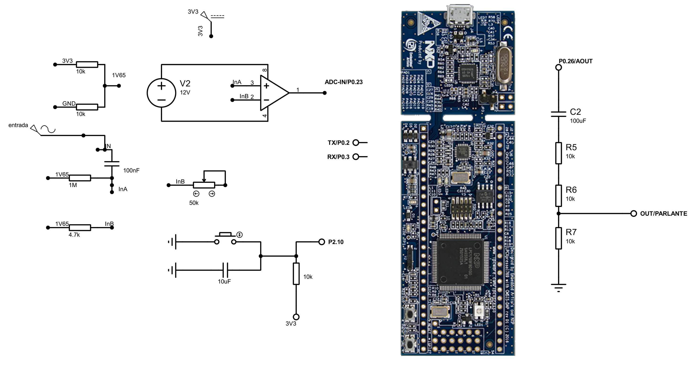
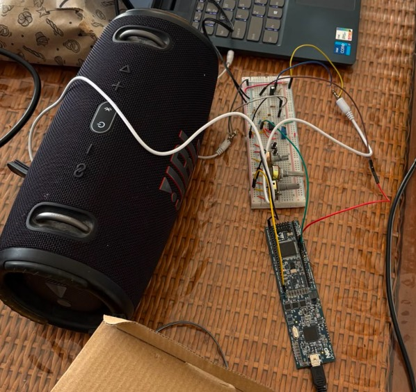

# Eco de Audio ADC-DAC con GPDMA en LPC1769

> **Asignatura:** Electronica Digital III - Universidad Nacional de Cordoba  
> **Integrantes:** Renata Monaldi, Tomas Faro, Lautaro Aguilar Bazán

> **Profesor: Marcos Javier Blasco


 ## &#x20;🚀 1. Descripción General del Proyecto .

 Este proyecto implementa un sistema de procesamiento de audio en tiempo real
sobre un microcontrolador LPC1769. La senal de entrada se captura por el ADC,
se procesa digitalmente en la CPU y se reproduce por el DAC integrado. Para
reducir la carga del procesador, la transferencia de muestras se realiza con
GPDMA en esquema ping-pong.

El sistema esta pensado como una aplicacion embebida de efectos de audio. El
usuario puede seleccionar entre un modo delay y un modo saturacion, ademas de
modificar parametros en tiempo real mediante comandos UART.

## 🎯 Alcances del Proyecto

**El sistema si es capaz de:**

- Capturar una senal analogica de audio por `AD0.0 / P0.23`.
- Reproducir la senal procesada por `AOUT / P0.26`.
- Procesar audio en bloques de 256 muestras.
- Usar GPDMA canal 2 para transferir datos del ADC a memoria.
- Usar GPDMA canal 3 para transferir datos de memoria al DAC.
- Generar un efecto de delay configurable entre 0 y 500 ms.
- Ajustar el repeat del eco entre 0 y 90 %.
- Aplicar un modo de saturacion con ganancia y limite configurables.
- Recibir comandos por UART0 a 115200 8N1.
- Alternar entre modos mediante un boton conectado a `EINT0 / P2.10`.

**El sistema no incluye:**

- Almacenamiento de audio en memoria externa o tarjeta SD.
- Interfaz grafica en PC o aplicacion movil.
- Conectividad inalambrica Wi-Fi o Bluetooth.
- Procesamiento estereo.
- Ecualizacion por bandas o filtros digitales avanzados.
- Etapa analogica completa de amplificacion de potencia.

# ⏩ Posibles Etapas Siguientes

- Disenar una placa PCB con conectores de entrada y salida de audio.
- Agregar una etapa analogica de acondicionamiento, filtrado y proteccion.
- Incorporar un codec de audio externo para mejorar resolucion y calidad.
- Implementar mas efectos, como chorus, flanger, tremolo o filtro pasa bajos.
- Crear una interfaz grafica para modificar parametros desde una PC.
- Agregar almacenamiento de presets en memoria no volatil.

### 📐 2. Arquitectura del Sistema: Hardware y Software 
### Hardware e Interconexion

El sistema usa perifericos internos del LPC1769 y una entrada/salida analogica
basica para audio.

| Bloque | Funcion | Recurso |
| --- | --- | --- |
| Entrada analogica | Captura de audio | ADC0 canal 0, `P0.23 / AD0.0` |
| Salida analogica | Reproduccion de audio | DAC, `P0.26 / AOUT` |
| Transferencia de entrada | Copia muestras ADC a memoria | GPDMA CH2 |
| Transferencia de salida | Copia muestras de memoria al DAC | GPDMA CH3 |
| Temporizacion | Marca la frecuencia de muestreo | Timer0 / MAT0.1 |
| Comunicacion | Comandos y monitoreo | UART0 TX P0.2, RX P0.3 |
| Boton de modo | Cambio entre efectos | EINT0, P2.10 |


#### Diagrama de Bloques

```text
Entrada de audio
      |
      v
ADC0.0 / P0.23
      |
      v
GPDMA CH2
      |
      v
Buffer ADC ping-pong en AHB SRAM
      |
      v
Procesamiento por CPU
      |
      v
Buffer DAC ping-pong en AHB SRAM
      |
      v
GPDMA CH3
      |
      v
DAC AOUT / P0.26
      |
      v
Salida de audio
```

*Fuente: Elaboración propia*


Descripción del Circuito y Consideraciones de Diseño: 	

- La entrada analogica debe mantenerse dentro del rango admitido por el ADC.
- La senal de audio se trabaja alrededor de media escala para poder representar
  valores positivos y negativos usando un DAC unipolar.
- La salida `AOUT` puede requerir una etapa externa de filtrado o amplificacion
  segun el uso final.
- El boton de modo se configura con pull-up y deteccion por flanco descendente.
- UART0 permite conectar una terminal serial para enviar comandos y observar
  el estado del sistema.
---
## ⚡ 3. Especificaciones Eléctricas, Alimentación y Entorno (Específico por Asignatura)

### Parametros de Alimentacion y Consumo

| Parametro | Valor |
| --- | --- |
| Tension logica del LPC1769 | 3.3 V |
| Entrada ADC | Rango compatible con el ADC del LPC1769 |
| Salida DAC | Salida analogica `AOUT` del microcontrolador |
| Metodo de alimentacion | Segun placa de desarrollo utilizada |
| Consumo estimado | Depende de la placa y etapa analogica externa |


IDE y SDK:  MCUXpresso IDE v11.8 con LPCOpen v2.10 
Microcontrolador Principal:  NXP LPC1769  
Periféricos Avanzados Utilizados:  NVIC, DMA, SysTick, DAC

## 🔄 4. Proceso de Integración y Desarrollo

### Etapa 1: Configuracion Base

Se configuraron los relojes principales de los perifericos usados: Timer0, ADC,
DAC y UART0. Tambien se definieron los parametros globales del sistema, como la
frecuencia de muestreo, el tamano de bloque y los canales DMA.

### Etapa 2: Adquisicion y Reproduccion

Se configuro el ADC para capturar la entrada analogica y el DAC para reproducir
muestras a una frecuencia estable. Timer0 se uso como base temporal para el
muestreo.

### Etapa 3: Integracion con GPDMA

Se agregaron los canales GPDMA pedidos por el proyecto:

- Canal 2 para transferir muestras desde ADC hacia memoria.
- Canal 3 para transferir muestras desde memoria hacia DAC.

Tambien se implementaron listas enlazadas LLI para sostener el funcionamiento
continuo con buffers ping-pong.

### Etapa 4: Procesamiento de Audio

Se implemento la conversion de muestras ADC a audio centrado, la linea circular
de delay, la mezcla de senal directa con senal retardada y el modo saturacion
con clipping duro.

### Etapa 5: Control por UART y Boton

Se agrego UART0 para modificar parametros en tiempo real y EINT0 para cambiar
de modo con un boton fisico. Los comandos se procesan sin detener el audio.

---

## 5. Ensayos, Pruebas y Resultados

### Pruebas Funcionales Realizadas

- Verificacion de inicializacion del DAC en media escala.
- Verificacion de recepcion de comandos por UART0.
- Cambio de modo entre delay y saturacion.
- Ajuste de tiempo de delay con comando `T`.
- Ajuste de repeat con comando `R`.
- Ajuste de ganancia de saturacion con comando `G`.
- Ajuste de limite de saturacion con comando `L`.
- Consulta de estado con comando `?`.
- Revision de errores DMA mediante `AudioEcho_GetDmaErrorFlags()`.
- Revision del contador de bloques mediante `AudioEcho_GetProcessedBlocks()`.


*Fuente: Elaboración propia*

Pruebas Funcionales Realizadas: Se inyecto señales con un generador de onda, también mediante el Jack de salida de audio de una computadora y por ultimo con una guitarra eléctrica stratocaster.

Evidencia Fotográfica y Gráficos:
https://github.com/user-attachments/assets/956acea3-147b-4a94-a1e5-bea3975f4d62


## 6. Comandos UART

| Comando | Funcion | Rango |
| --- | --- | --- |
| `T<ms>` | Cambia el tiempo de delay | 0 a 500 ms |
| `R<porcentaje>` | Cambia el repeat | 0 a 90 % |
| `G<ganancia>` | Cambia la ganancia del saturador | 1x a 32x |
| `L<limite>` | Cambia el limite de saturacion | 32 a 511 LSB |
| `D` | Activa modo delay | Sin valor |
| `S` | Activa modo saturacion | Sin valor |
| `?` | Consulta el estado actual | Sin valor |

Cuando se recibe un comando valido, el firmware actualiza la variable
correspondiente e informa el estado actual por UART.
